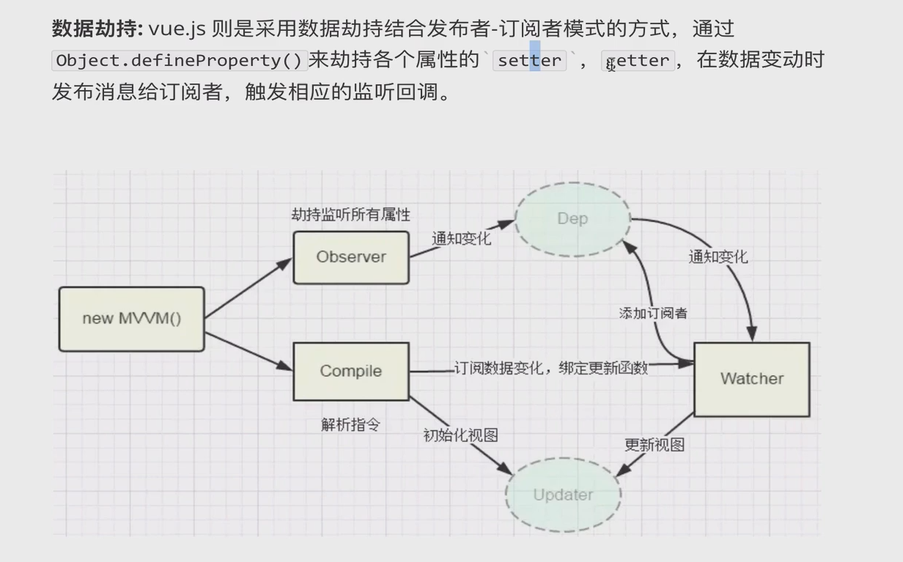

#### Vue-MVVM响应式原理

1. 讲一讲MVC：

   model (数据模型) -> view(视图层) ->controller(控制器)

   原理：C层需要控制model层的数据在view层进行显示，在C层进行通知view视图更新或者通知model数据改变得操作，需要直接操作DOM去视图更新

2. 讲一讲MVVM：(响应式，双向数据绑定)

   model (数据模型) -> view(视图层) ->view-model(控制器)

   原理：viewModel相当于一个驱动，这种驱动传达视图和数据绑定的通信，修改view，model相应得改变，model改变不需要操作DOM,直接更新视图，在这个过程中view和model是没有直接得接触

   低耦合：View可以独立于Model变化和修改，同一个ViewModel可以被多个View复用；并且可以做到View和Model的变化互不影响；

   可重用性：可以把一些视图的逻辑放在ViewModel，让多个View复用；

    独立开发：开发人员可以专注与业务逻辑和数据的开发(viewModel)；

   可测试性：清晰的View分层，使得针对表现层业务逻辑的测试更容易，更简单

在vue中MVVM

​		vue采用数据劫持结合发布者-订阅者模式得方式，通过Object.definerproperty()来劫持每个属性setter和getter, 在数据变动时，发布消息给依赖收集器(Dep)，通知对应观察者(watcher)做对应得回调函数，去更新视图。

​		MVVM作为绑定入口，整合Observer、Compile、Watcher三者，通过Observer来监听model得数据变化，通过Conpile来解析编译模板指令，最终通过Watcher搭起他们两个之间的通信桥梁，**达到数据变化驱动视图更新，视图交互变更数据的双向绑定效果**

